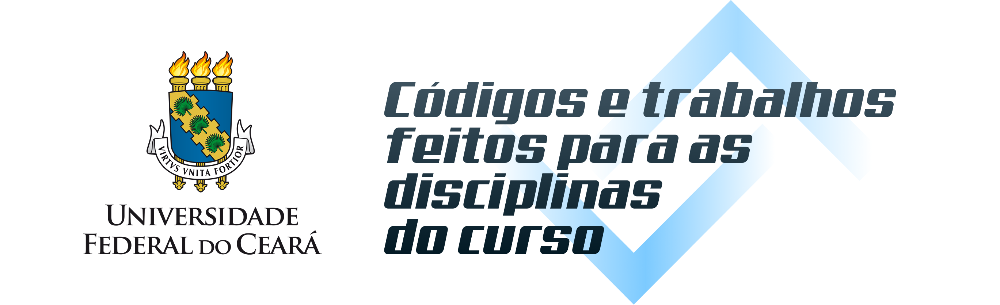

# UFC - Códigos e projetos

## 1º Semestre - Fundamentos de Programação

- [Códigos do curso](./1-Semestre/Curso%20extra%20de%20python/) extradisciplinar de Python

- [Códigos da disciplina](./1-Semestre/Fundamentos%20de%20Programa%C3%A7%C3%A3o/) de Fundamentos de Programação

    - Lista 1 - Estrutura sequencial 1
    - Lista 2 - Estrutura sequencial 2
    - Lista 3 - Estrutura de decisão
    - Lista 4 - Estrutura de repetição 1
    - Lista 5 - Estrutura de repetição 2
    - Lista 6 - Trabalhando com Arrays
    - Lista 7 - Manipulação de Strings
    - Lista 8 - Trabalhando com Matriz
    - Lista 9 - Trabalhando com recursão
    - Agenda telefônica (Projeto final)

## 3º Semestre - Orientação a Objetos

- [Crud gerenciamento de usuários](./3-Semestre/) (Projeto final)

## 4º Semestre - Fundamentos de banco de dados

- [Gerenciamento de clínica médica](./4-Semestre/) (Projeto final)
